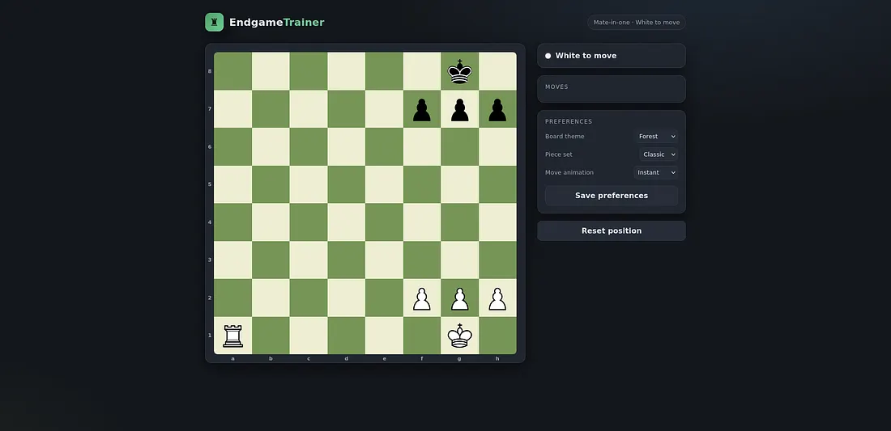
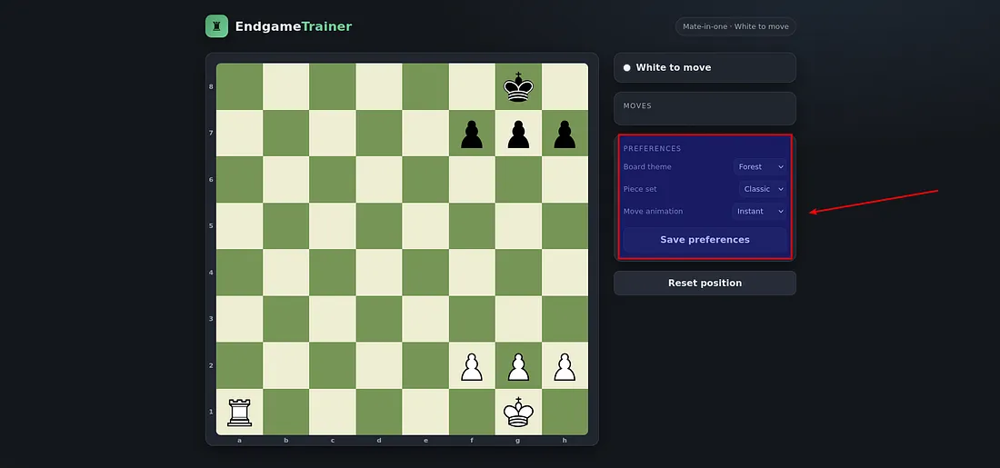
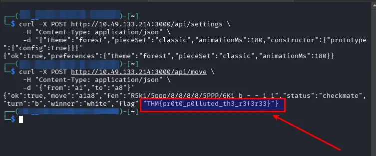
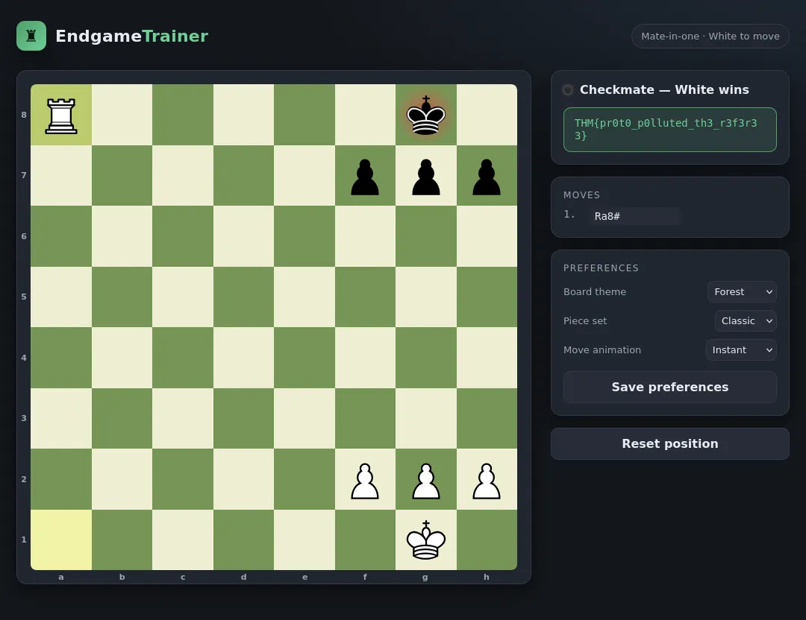

# ♟ Fool's Mate, Revenge

## TryHackMe — Advanced Web Security Walkthrough

A premium, portfolio-ready security assessment of a hardened Node.js chess application where unsafe object merging enables **Prototype Pollution** and an authorization-state bypass.

| Property | Value |
|---|---|
| Platform | TryHackMe |
| Room | Fool's Mate, Revenge |
| Category | Web Security |
| Difficulty | Advanced |
| Primary Vulnerability | Prototype Pollution |
| Impact | Reward-gate bypass |
| Target Stack | Node.js / JSON API |

## Attack Chain

```text
Recon
  ↓
/api/move
  ↓
Reward gate disclosure
  ↓
/api/settings
  ↓
Unsafe deep merge
  ↓
constructor.prototype
  ↓
Inherited config state
  ↓
Ra8#
  ↓
Reward unlocked
```

## 01 — Room Overview


The sequel moves the important security check into the backend, creating a more realistic trust boundary for the assessment.

## 02 — Endgame Analysis



The intended winning move is the back-rank mate:

```text
Ra8#
```

The important question is whether the backend permits the reward associated with a valid checkmate.

## 03 — Server-Side Gate

Submitting the move through `/api/move` produces a valid checkmate result but reports that the reward is locked because:

```text
session.config.unlocked
```

This error exposes the exact server-side state path worth investigating.

## 04 — Preferences Attack Surface



The Preferences panel sends JSON to `/api/settings`. Reviewing the client JavaScript shows that user-selected properties are serialized and sent directly to the server.

That creates an object-processing boundary.

## 05 — Prototype Pollution

A recursive deep-merge implementation accepts prototype-sensitive keys. A nested test payload can trigger recursive failure, confirming the unsafe merge behavior.

The stable exploitation strategy uses:

```text
constructor → prototype → config = true
```



This modifies inherited object behavior rather than directly rewriting a session object.

## 06 — Authorization Bypass

Once inherited `config` state resolves as truthy, the original checkmate request is replayed:

```text
a1 → a8
```



The server now accepts the move and opens the reward path.

## 07 — Core Finding

The vulnerability is best understood as a chain:

```text
Unsafe object merge
      +
Prototype manipulation
      +
Authorization trusting inherited state
      =
Reward-gate bypass
```

## Flag

The public portfolio version intentionally redacts the challenge flag:

```text
THM{REDACTED_FOR_PUBLICATION}
```

## Remediation

- Allowlist accepted preference fields.
- Reject `__proto__`, `constructor`, and `prototype`.
- Avoid generic recursive merges for untrusted JSON.
- Validate request schemas.
- Make security decisions depend on explicit validated own-properties.
- Prevent stack traces and development diagnostics from reaching users.

## Full Documentation

[Read the complete technical walkthrough](../Documentation/Documentation.md)

## Repository

[GitHub](https://github.com/anurag-rvnkr1/Fools-Mate-Revenge-TryHackMe-Walkthrough)

---

**Author:** Anurag Revankar
